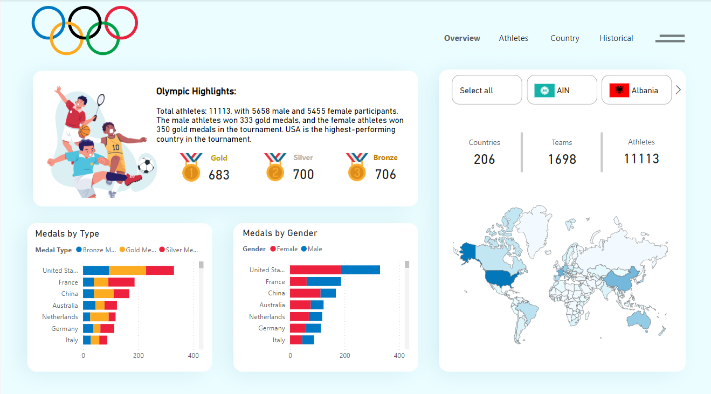
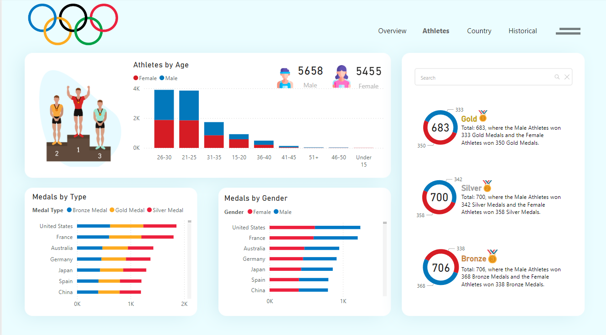
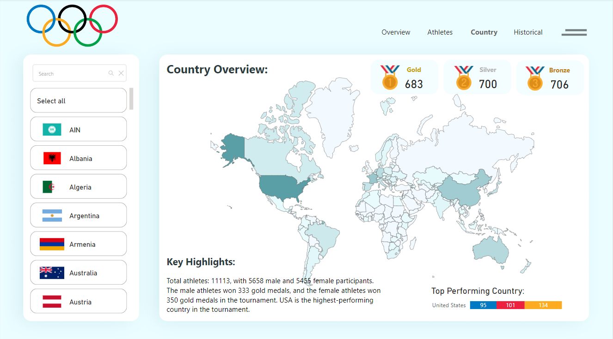
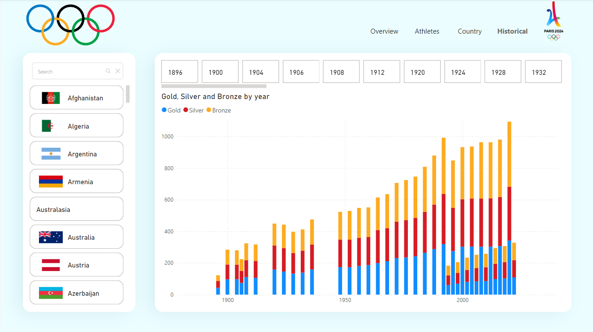

# 🏅 Olympics Dashboard Project

Another Power BI project! This one was very fun and probably the cleanest out of them so far. It also took me a good amount of time to complete! This dashboard is for the 2024 Olympics with a Kaggle dataset — however, when this was being made, the Olympics were ongoing, and the dataset being used was consistently being updated. The Python file, *app.py*, covers that and makes this dashboard entirely updated! The rest of the details will be explained below!

Side note: I've attached images at the end in case you prefer not opening the `.pbix` file — our school accounts haven't permitted us to use Power BI's upload service otherwise it would be up there, sorry!!

## 🛠️ Tools and Technologies Used
- 📊 **Kaggle**: Source for continuously updated Olympic data.
- 🖥️ **Power BI**: Dashboard creation and data visualization.
- 📋 **Excel**: Data preprocessing and manipulation.
- 🐍 **Python**: Python was used to augment Power BI's capabilities with the following libraries:
  - **Pandas**: For data wrangling and cleaning.
  - **NumPy**: For numerical computations.
  - **Matplotlib**: For creating visualizations in Python scripts embedded in Power BI.
  - **Seaborn**: For aesthetic and statistical visualizations in Power BI.
  - **Plotly**: For interactive visuals (although limited by Power BI’s interface).
  - **OS**: For handling file paths and directory access in Python.

## 📊 Dashboard Features
The dashboard is split into 5 interactive pages, each serving its own purpose:

### 1. 🌟 Overview
This page highlights key statistics from the Olympics, such as:
- 🏅 **Medals by country**: Displays the distribution of gold, silver, and bronze medals.
- 👩‍🦰👨‍🦱 **Gender breakdown**: Insight into participation and performance by gender.
- 🏅 **Event type analysis**: Medal distribution across different sports.
- (and way more!)

### 2. 🏃‍♀️ Athletes
Explore detailed information about participating athletes and medalists. Key features include:
- 🔍 **Searchable athlete information**: Makes it easy to locate specific athletes.
- 🏅 **Medalist details**: A quick overview of athletes who won medals.

### 3. 🎖️ Podium
This page focuses on the **top-three rankings** across various metrics, utilizing Python visualizations created with:
- **Matplotlib** and **Seaborn**: To create bar plots showing top countries by gold, silver, and bronze medals.
- **Plotly**: Used for interactive charts like pie charts of the top-performing countries.
- **NumPy**: Used for numerical computations for the charts.

### 4. 🌍 Country Overview
Delve into the performance of top-performing countries, showcasing:
- 🥇 **Top countries by medals**: A snapshot of the countries with the highest medal counts.
- 📊 **Detailed country-level analysis**: Explore the number of medalists per country and trends in performance.

### 5. 📅 Historical
This page compares historical Olympic data with the current year's results, giving insight into:
- 📈 **Performance over time**: Track changes in the medal distribution across previous Olympic Games.
- 📊 **Comparison with past events**: Analyze how the current year's performance stacks up against historical trends.

## 📂 Dataset
The dataset is continually updated during the course of the Olympics, ensuring real-time data for accurate and relevant visualizations. It is sourced from **Kaggle** and processed using **Python (Pandas)** and **Excel**.

## 🚀 How to Run the Project
To explore the project, you will need:
1. 💻 **Power BI Desktop**: Open the `.pbix` file in Power BI to interact with the visualizations.
2. 🐍 **Python (optional)**: If you wish to modify or update the dataset manually using Python, ensure you have the required dependencies installed:
   - `pandas`, `os`, `matplotlib`, `seaborn`, `plotly`, `numpy`

   **Note**: In Power BI, the Python environment must have these libraries installed for the embedded visuals to work correctly.

## 📧 Contact
Feel free to reach out if you have any questions or feedback! 😊
My contacts are listed in my About Me!

# Olympics Dashboard Gallery

Here are some screenshots from the dashboard:

  

  

  

  

